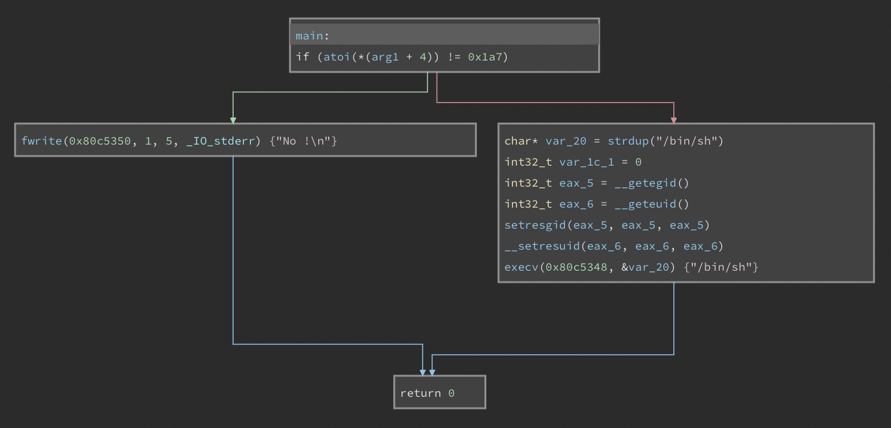

## level0
При входе на уровень мы видим исполняемый файл level0. Посмотрим его через [средства](https://cloud.binary.ninja/) реверс-инженеринга.

Можно заметить, что в данном коде первый аргумент сравнивается с числом `0x1a7`, которое в десятичной системе соответствует числу 423. При совпадении аргумента с заданным числом код переходит в блок, открывающий `/bin/sh`. Учитывая, что этот бинарник принадлежит пользователю level1, пройдя в этот блок, мы попадаем в оболочку от имени этого пользователя и можем получить доступ к файлу `level1/.pass`.
