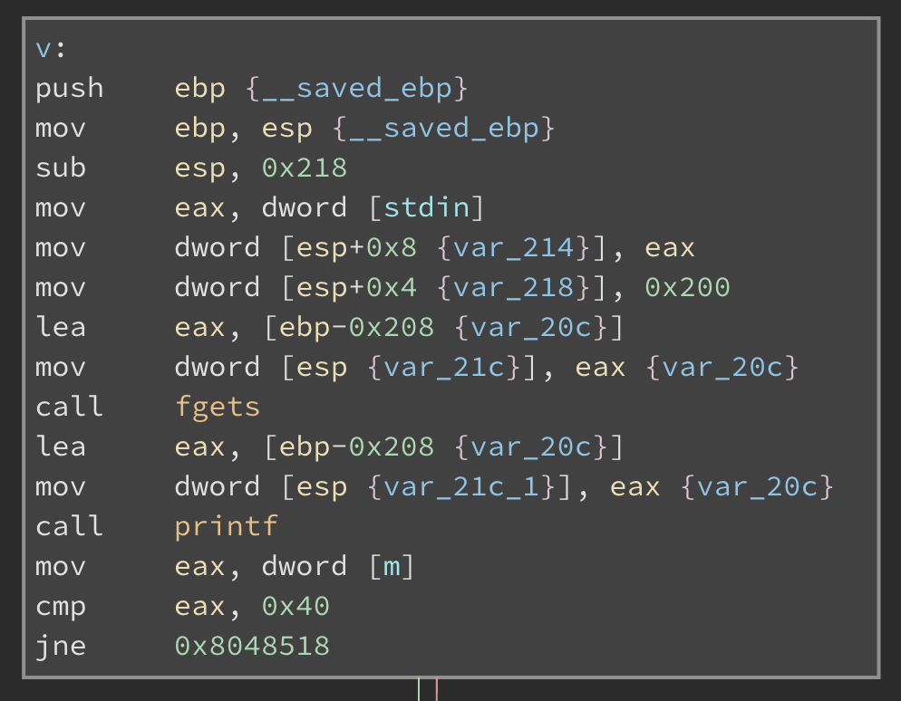

## level3
Мы находит две функции:  `main` и `v`, причем `v` вызывается из `main`. Кроме того, существует глобальная переменная `m` по адресу `0x084988c`:

```c
uint32_t m = 0x0;
```

Функция `main` ничего не делает, в то время как `v` сначала выводит через `printf` строку, переданную ей на стандартном вводе. После этого, если переменная `m` равна `0x40`, запускается командная оболочка. 

Нам нужно присвоить `m` необходимое значение, для чего можно воспользоваться атакой [uncontrolled format string](https://en.wikipedia.org/wiki/Uncontrolled_format_string). С помощью типа формата `%n` мы можем изменить содержание памяти в любой области стека. 

Используя дизассемблер, мы обнаруживаем, что строка форматирования (обозначенная на графике ниже через `var_20c`) находится на расстоянии `0x218-0x208=16`  байтов от вершины стека. 



Так как каждый адрес на 32-битовых системах занимает 4 байта, мы “просим” `printf`  использовать в качестве адреса назначения четвертый аргумент. Наконец, на момент вызова формата `%n` размер выведенной строки должен быть равен 64, ведь это именно то значение, которое будет присвоено переменной `m`. Учитывая эти требования, мы получаем следующий эскплойт:

```sh
$ (python -c 'print "\x8c\x98\x04\x08" + "%10x"*6 + "%4$n"'; echo "cd ..; cat level4/.pass") | ./level3
b209ea91ad69ef36f2cf0fcbbc24c739fd10464cf545b20bea8572ebdc3c36fa
```
